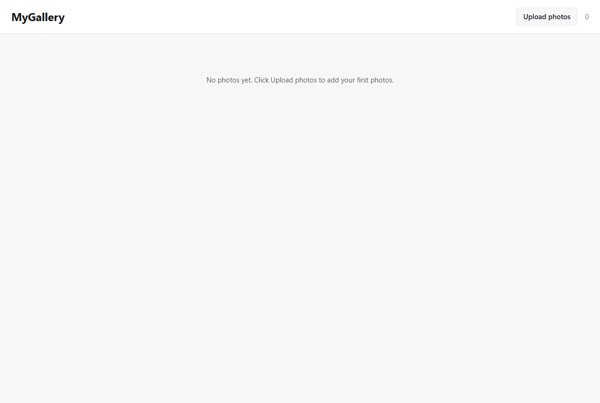
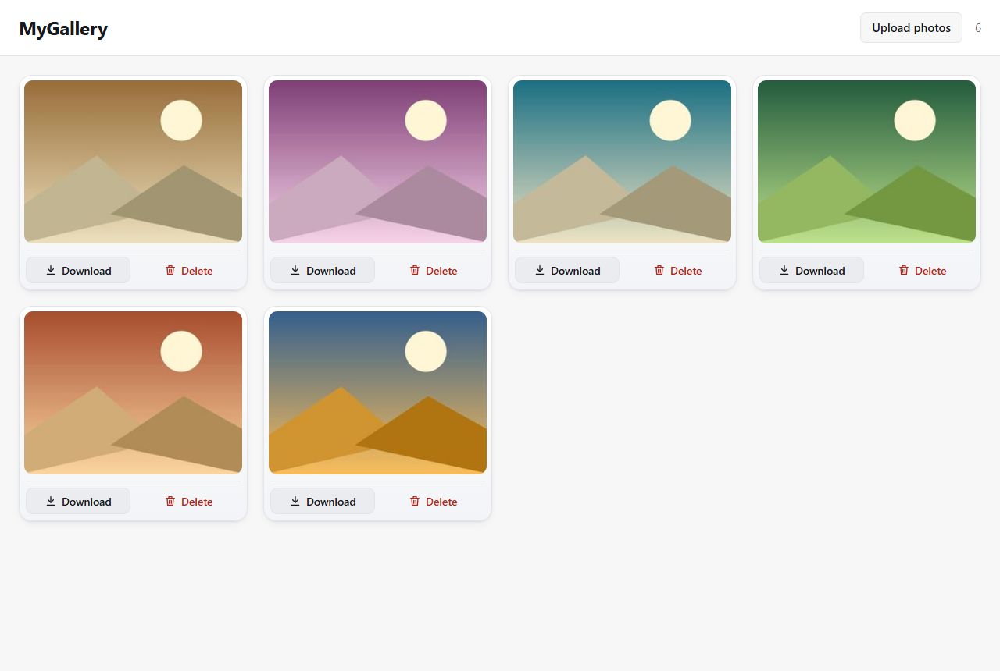
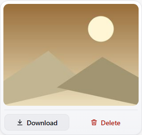
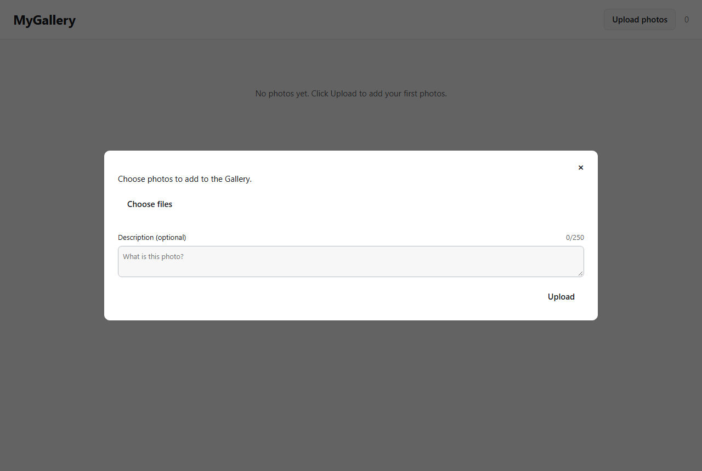
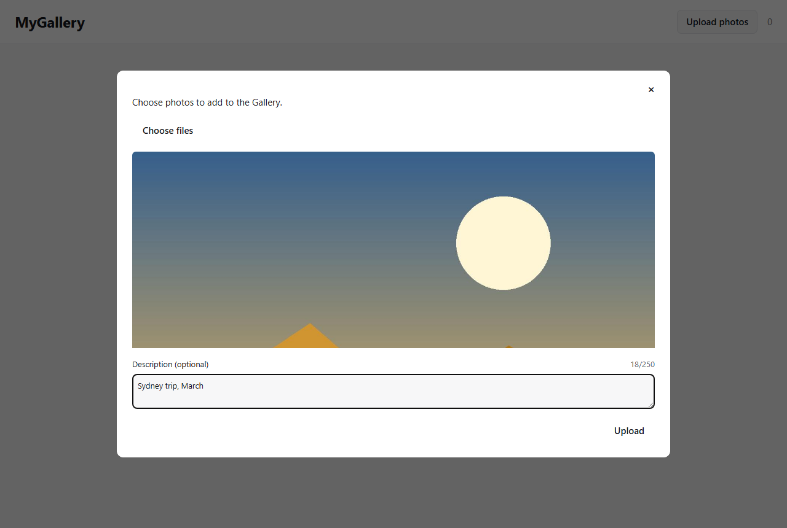
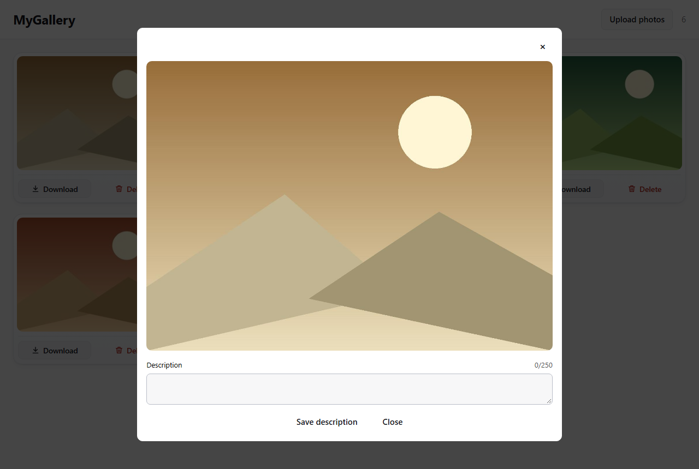
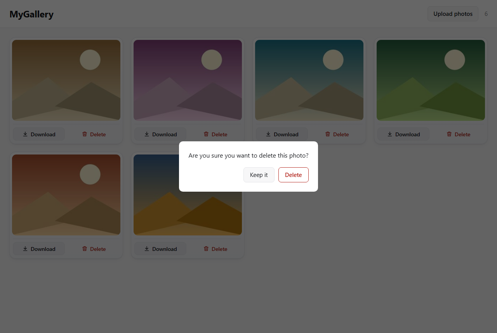
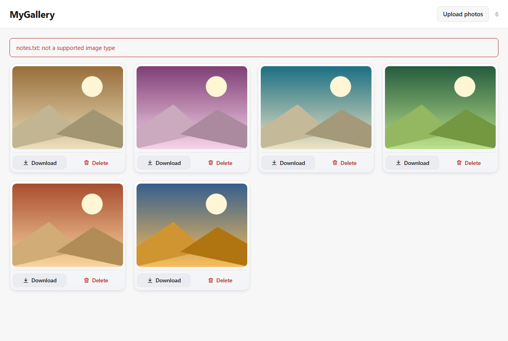

# MyGallery User Manual

Contents:

1. [About this manual](#1-about-this-manual)
2. [What MyGallery is](#2-what-mygallery-is)
3. [Before you start](#3-before-you-start)
   - 3.1 [What you need](#31-what-you-need)
   - 3.2 [Install Python](#32-install-python)
4. [Starting and stopping MyGallery](#4-starting-and-stopping-mygallery)
   - 4.1 [Start MyGallery](#41-start-mygallery)
   - 4.2 [Open the Gallery again while MyGallery is running](#42-open-the-gallery-again-while-mygallery-is-running)
   - 4.3 [Stop MyGallery](#43-stop-mygallery)
5. [Getting started: your first Photo](#5-getting-started-your-first-photo)
   - 5.1 [Add your first Photo](#51-add-your-first-photo)
6. [The Gallery screen](#6-the-gallery-screen)
   - 6.1 [What a Thumbnail card shows](#61-what-a-thumbnail-card-shows)
7. [Adding Photos](#7-adding-photos)
   - 7.1 [Add Photos to your Gallery](#71-add-photos-to-your-gallery)
     - 7.1a [Choose files by dropping them on the popup](#71a-choose-files-by-dropping-them-on-the-popup)
   - 7.2 [Close the Upload popup without adding anything](#72-close-the-upload-popup-without-adding-anything)
8. [Looking at Photos](#8-looking-at-photos)
   - 8.1 [Find a Photo in the Gallery](#81-find-a-photo-in-the-gallery)
   - 8.2 [See a Photo at a larger size](#82-see-a-photo-at-a-larger-size)
9. [Describing Photos](#9-describing-photos)
   - 9.1 [Where a description is shown](#91-where-a-description-is-shown)
   - 9.2 [Describe a Photo as you upload it](#92-describe-a-photo-as-you-upload-it)
   - 9.3 [Change a Photo's description](#93-change-a-photos-description)
10. [Getting your Photos back out](#10-getting-your-photos-back-out)
    - 10.1 [Where your Photos are kept, and who can reach them](#101-where-your-photos-are-kept-and-who-can-reach-them)
    - 10.2 [Download a Photo](#102-download-a-photo)
    - 10.3 [Back up your Gallery](#103-back-up-your-gallery)
11. [Removing Photos](#11-removing-photos)
    - 11.1 [Delete a Photo](#111-delete-a-photo)
12. [Reference](#12-reference)
    - 12.1 [Which files become a Photo](#121-which-files-become-a-photo)
    - 12.2 [Limits](#122-limits)
13. [When something does not work](#13-when-something-does-not-work)
    - 13.1 [What happens when part of an Upload fails](#131-what-happens-when-part-of-an-upload-fails)
    - 13.2 [A file was refused as not a supported image type](#132-a-file-was-refused-as-not-a-supported-image-type)
    - 13.3 [A file was refused as too large](#133-a-file-was-refused-as-too-large)
    - 13.4 [MyGallery will not start: "Python was not found"](#134-mygallery-will-not-start-python-was-not-found)
    - 13.5 [MyGallery will not start: "Address already in use"](#135-mygallery-will-not-start-address-already-in-use)
    - 13.6 [The browser did not open](#136-the-browser-did-not-open)
    - 13.7 [Windows blocked MyGallery from creating its Gallery folder](#137-windows-blocked-mygallery-from-creating-its-gallery-folder)
14. [Glossary](#14-glossary)

---

## 1. About this manual

MyGallery 0.1.0 runs on Windows 11. This manual covers starting the
application, adding Photos, looking at them, describing them, downloading them
and deleting them.

| What | Value |
| --- | --- |
| Product | MyGallery 0.1.0 |
| Document version | 1.0 |
| Date | 2026-09-23 |
| Audience | The person who uses MyGallery on their own Windows 11 PC |

Developing MyGallery is not covered here. `README.md` holds that material, in
its "Working on MyGallery" section.

### Conventions

**Bold** names a control you act on, such as a button, a field label or a key.
`Code font` names a file, a folder or a web address. Text the application
displays is quoted in double quotation marks, exactly as it appears on screen.

A callout is one of five kinds:

| Callout | What it means |
| --- | --- |
| **Note** | Worth noticing even when you are skimming |
| **Tip** | Optional advice that saves you time |
| **Important** | Essential to getting the task done |
| **Caution** | You could lose work, or have to do something again |
| **Warning** | Certain or severe: something is removed for good |

Photo, Gallery, Thumbnail, Upload, Download and Delete carry a capital letter,
because each names something particular in MyGallery. Larger view carries a
capital L alone. A photo in lower case is one you have not added yet, and it
becomes a Photo at its Upload.

A label or message is quoted exactly as it is written on screen, even where its
wording differs from this manual's. An empty Gallery reads "No photos yet. Click
Upload photos to add your first photos." This manual's own instructions say
select rather than click. Windows Security is Microsoft's product, not part of
MyGallery. Its labels keep the United States spelling and the ampersand the
screen shows, as in **Virus & threat protection**.

Two controls read **Close**, the Upload popup's and the Larger view's, and each
is named with the popup or view it belongs to. `.brain/glossary.md` defines the
Larger view as reached when you activate a Thumbnail. This manual's own
instructions say select instead.

## 2. What MyGallery is

MyGallery keeps your photos on your own PC and shows them together as one
Gallery. A photo you add becomes a Photo, with a Thumbnail in the Gallery. From
its Thumbnail you can see a Photo at a larger size, describe it, download it, or
delete it.

You reach MyGallery in your web browser, from a program you start on your PC.
There is no sign-in and no account, and no other device on your network can
reach it. See [Where your Photos are kept, and who can reach them](#101-where-your-photos-are-kept-and-who-can-reach-them).

| To | Chapter |
| --- | --- |
| Get MyGallery running the first time | [3. Before you start](#3-before-you-start) |
| Start and stop MyGallery | [4. Starting and stopping MyGallery](#4-starting-and-stopping-mygallery) |
| Add your first Photo | [5. Getting started: your first Photo](#5-getting-started-your-first-photo) |
| Learn what is on the screen | [6. The Gallery screen](#6-the-gallery-screen) |
| Add more Photos | [7. Adding Photos](#7-adding-photos) |
| Find a Photo and see it larger | [8. Looking at Photos](#8-looking-at-photos) |
| Describe a Photo | [9. Describing Photos](#9-describing-photos) |
| Download a Photo, or back up your Gallery | [10. Getting your Photos back out](#10-getting-your-photos-back-out) |
| Delete a Photo | [11. Removing Photos](#11-removing-photos) |
| Check a limit or an accepted format | [12. Reference](#12-reference) |
| Find out why something is not working | [13. When something does not work](#13-when-something-does-not-work) |
| Check what a word means | [14. Glossary](#14-glossary) |

## 3. Before you start

MyGallery starts once Python 3.12 or later is installed on your PC.

### 3.1 What you need

MyGallery runs on Windows 11, needs Python 3.12 or later, and is used in Chrome
or Edge.

| Requirement | Value |
| --- | --- |
| Operating system | Windows 11 |
| Software | Python 3.12 or later |
| Web browser | Chrome or Edge |

**See also:**

- [3.2 Install Python](#32-install-python)
- [4.1 Start MyGallery](#41-start-mygallery)

### 3.2 Install Python

Installing Python is the one thing you set up yourself before MyGallery will
start.

**To install Python:**

1. Go to `https://www.python.org/downloads/windows/` and download Python 3.12
   or later.
2. In the installer, select **Add python.exe to PATH**.
3. Complete the installer.

**Result:** The installer reports that the installation succeeded.

**See also:**

- [3.1 What you need](#31-what-you-need)
- [4.1 Start MyGallery](#41-start-mygallery)

## 4. Starting and stopping MyGallery

MyGallery runs only while the console window it opens stays open.

### 4.1 Start MyGallery

Starting MyGallery opens your Gallery in your web browser, and you do it at the
start of every session.

**Before you begin**

- Python 3.12 or later is installed. See [3.2 Install Python](#32-install-python).

**To start MyGallery:**

1. Open `scripts/start.cmd`. A black window opens, and MyGallery runs only
   while that window stays open.
2. Wait for your web browser to open at `http://127.0.0.1:8765`. The first run
   takes a minute while MyGallery prepares itself, and every run after that is
   immediate.

**Result:** Your Gallery is shown in your web browser at
`http://127.0.0.1:8765`.

**See also:**

- [4.3 Stop MyGallery](#43-stop-mygallery)
- [13.7 Windows blocked MyGallery from creating its Gallery folder](#137-windows-blocked-mygallery-from-creating-its-gallery-folder)
- [13. When something does not work](#13-when-something-does-not-work), where MyGallery will not start or your web browser does not open

### 4.2 Open the Gallery again while MyGallery is running

The address stays live for as long as MyGallery is running, so you can open
your Gallery again at any time.

**Before you begin**

- MyGallery is running. See [4.1 Start MyGallery](#41-start-mygallery).

**To open the Gallery again:**

- Go to `http://127.0.0.1:8765` in your web browser.

**Result:** Your Gallery is shown.

**See also:**

- [4.1 Start MyGallery](#41-start-mygallery)
- [4.3 Stop MyGallery](#43-stop-mygallery)

### 4.3 Stop MyGallery

Stopping MyGallery ends your session, and your Gallery is not reachable again
until you start MyGallery.

**Before you begin**

- MyGallery is running. See [4.1 Start MyGallery](#41-start-mygallery).

**To stop MyGallery, do one of the following:**

- Close the black window MyGallery opened when it started.
- In that window, press **Ctrl+C**.

**Result:** `http://127.0.0.1:8765` no longer answers.

**See also:**

- [4.1 Start MyGallery](#41-start-mygallery)

## 5. Getting started: your first Photo

Your first Photo takes four steps.

### 5.1 Add your first Photo

Adding your first Photo uses the Upload popup, and ends with a Thumbnail in
your Gallery.

**Before you begin**

- Python 3.12 or later is installed. See [3.2 Install Python](#32-install-python).

**To add your first Photo:**

1. Open `scripts/start.cmd`. Your web browser opens at `http://127.0.0.1:8765`,
   showing your empty Gallery with "No photos yet. Click Upload photos to add
   your first photos."

   

2. Select **Upload photos**. The Upload popup opens.
3. Select **Choose files**, then choose one photo on your PC. A preview of it
   appears in the popup.
4. Select **Upload**.

**Result:** Your Gallery shows one Thumbnail, for the Photo you added.

**Next steps**

| To | See |
| --- | --- |
| Add more Photos | [7.1 Add Photos to your Gallery](#71-add-photos-to-your-gallery) |
| Learn what is on the Gallery screen | [6. The Gallery screen](#6-the-gallery-screen) |
| See a Photo at a larger size | [8.2 See a Photo at a larger size](#82-see-a-photo-at-a-larger-size) |
| Describe a Photo | [9. Describing Photos](#9-describing-photos) |

**See also:**

- [13.7 Windows blocked MyGallery from creating its Gallery folder](#137-windows-blocked-mygallery-from-creating-its-gallery-folder)

## 6. The Gallery screen

The Gallery screen is what MyGallery shows once it starts.

| Region | What it is for |
| --- | --- |
| **MyGallery** | The page heading |
| **Upload photos** | Opens the Upload popup, to add Photos |
| The count of Photos | Shows the number of Photos in the Gallery |
| The Gallery | Shows a Thumbnail card for every Photo, most recently uploaded first |

**See also:**

- [6.1 What a Thumbnail card shows](#61-what-a-thumbnail-card-shows)
- [7.1 Add Photos to your Gallery](#71-add-photos-to-your-gallery)
- [8.1 Find a Photo in the Gallery](#81-find-a-photo-in-the-gallery)

### 6.1 What a Thumbnail card shows

Each Photo in the Gallery has a Thumbnail card.

| Part | What it is for |
| --- | --- |
| The image | The Photo's Thumbnail |
| **Download** | Downloads the Photo |
| **Delete** | Deletes the Photo |

**Download** and **Delete** are shown on every Thumbnail card without resting
the pointer on it.

**See also:**

- [6. The Gallery screen](#6-the-gallery-screen)
- [8.2 See a Photo at a larger size](#82-see-a-photo-at-a-larger-size)
- [10.2 Download a Photo](#102-download-a-photo)
- [11.1 Delete a Photo](#111-delete-a-photo)

## 7. Adding Photos

Photos are added through the Upload popup, whether you pick files or drop them
onto it.

### 7.1 Add Photos to your Gallery

Uploading adds one or more Photos to your Gallery. One Upload carries up to 30
files.

**Before you begin**

- MyGallery is running. See [4.1 Start MyGallery](#41-start-mygallery).

**To add Photos:**

1. In the header, select **Upload photos**. The Upload popup opens.

   

2. Select **Choose files**, then choose one or more photos on your PC. A
   preview of each chosen file appears in the popup.
3. Check the previews against the files you meant to choose.
4. Optional: In the **Description (optional)** field, enter a description for
   the Photos in this Upload. See [9.2 Describe a Photo as you upload it](#92-describe-a-photo-as-you-upload-it).

   

5. Select **Upload**.

**Result:** Your Gallery shows a new Thumbnail card for each Photo you added,
with the most recently uploaded first.

**See also:**

- [7.2 Close the Upload popup without adding anything](#72-close-the-upload-popup-without-adding-anything)
- [9.2 Describe a Photo as you upload it](#92-describe-a-photo-as-you-upload-it)
- [12.2 Limits](#122-limits)
- [13.1 What happens when part of an Upload fails](#131-what-happens-when-part-of-an-upload-fails)

#### 7.1a Choose files by dropping them on the popup

You can choose files by dragging them onto the open Upload popup from File
Explorer, instead of selecting **Choose files**.

**To choose files by dropping them:**

- With the Upload popup open, drag one or more photos from File Explorer and
  drop them on the popup.

**Result:** A preview of each dropped file appears in the popup, the same as
files chosen with **Choose files**.

### 7.2 Close the Upload popup without adding anything

Closing the Upload popup without uploading leaves your Gallery unchanged, and
you can open it again later.

**Before you begin**

- The Upload popup is open. See [7.1 Add Photos to your Gallery](#71-add-photos-to-your-gallery).

**To close the Upload popup without adding anything:**

- On the Upload popup, select the **Close** cross.

**Result:** The popup closes, and no Photo is added to your Gallery.

**See also:**

- [7.1 Add Photos to your Gallery](#71-add-photos-to-your-gallery)

## 8. Looking at Photos

Every Photo in your Gallery has a Thumbnail you can find, then open at a
larger size.

### 8.1 Find a Photo in the Gallery

Your Gallery shows a Thumbnail card for every Photo, ordered by the most
recently uploaded first. Scrolling to the end of what is loaded loads further
Thumbnails, rather than a numbered page control.

**To find a Photo:**

- Scroll through the Gallery until you see its Thumbnail card.

**Result:** The Photo's Thumbnail card is shown.

**See also:**

- [6. The Gallery screen](#6-the-gallery-screen)
- [8.2 See a Photo at a larger size](#82-see-a-photo-at-a-larger-size)

### 8.2 See a Photo at a larger size

Selecting a Photo's Thumbnail shows it in the Larger view, over the Gallery,
at a size bigger than its Thumbnail.

**Before you begin**

- The Photo's Thumbnail card is shown in the Gallery. See [8.1 Find a Photo in the Gallery](#81-find-a-photo-in-the-gallery).

**To see a Photo at a larger size:**

1. In the Gallery, select the Photo's Thumbnail. The Larger view opens over
   the Gallery, showing that Photo.

   

2. To return to the Gallery, do one of the following:
   - Press **Escape**.
   - On the Larger view, select the **Close** cross.
   - Beside **Save description**, select **Close**.

**Result:** The Gallery is shown again, at the position it was scrolled to.

**See also:**

- [8.1 Find a Photo in the Gallery](#81-find-a-photo-in-the-gallery)
- [9.3 Change a Photo's description](#93-change-a-photos-description)
- [6.1 What a Thumbnail card shows](#61-what-a-thumbnail-card-shows)

## 9. Describing Photos

A Photo can carry a description, given at its Upload or added afterwards.

### 9.1 Where a description is shown

A Photo's description is the alt text of its Thumbnail. Alt text is what a
screen reader announces in place of an image, and what a browser shows where the
image itself cannot be displayed.

A Photo with no description carries its filename as alt text instead, so every
Thumbnail has something to announce.

The same description is in the **Description** field of that Photo's Larger
view, which is where you change it. Changing it there changes the Thumbnail's
alt text with it.

A description is yours alone, because MyGallery is reached from your own PC
only. It does not rename the Photo's file, and it does not group Photos.

**See also:**

- [9.2 Describe a Photo as you upload it](#92-describe-a-photo-as-you-upload-it)
- [9.3 Change a Photo's description](#93-change-a-photos-description)
- [6.1 What a Thumbnail card shows](#61-what-a-thumbnail-card-shows)
- [8.1 Find a Photo in the Gallery](#81-find-a-photo-in-the-gallery)

### 9.2 Describe a Photo as you upload it

Giving a Photo a description at its Upload means it does not carry its filename
as alt text instead. A description is not required, and an Upload made with no
description still succeeds.

**Before you begin**

- The Upload popup is open with files chosen. See [7.1 Add Photos to your Gallery](#71-add-photos-to-your-gallery).

**To describe a Photo as you upload it:**

1. In the **Description (optional)** field, enter a description. A count
   beside the field shows how many of the 250 characters you have used, for
   example `18/250`. Typing or pasting past 250 characters stops the field at
   250 rather than refusing the Upload.
2. Select **Upload**.

**Result:** The Photo's Larger view shows the description you entered. See
[8.2 See a Photo at a larger size](#82-see-a-photo-at-a-larger-size).

**See also:**

- [7.1 Add Photos to your Gallery](#71-add-photos-to-your-gallery)
- [9.1 Where a description is shown](#91-where-a-description-is-shown)
- [9.3 Change a Photo's description](#93-change-a-photos-description)

### 9.3 Change a Photo's description

Changing a Photo's description updates its Thumbnail's alt text.

**Before you begin**

- The Photo's Larger view is open. See [8.2 See a Photo at a larger size](#82-see-a-photo-at-a-larger-size).

**To change a Photo's description:**

1. In the **Description** field, enter a description of up to 250 characters.
   The field already holds the Photo's current description, or is empty where
   it has none.
2. Select **Save description**.

**Result:** The **Description** field in the Larger view shows the description
you entered.

**See also:**

- [8.2 See a Photo at a larger size](#82-see-a-photo-at-a-larger-size)
- [9.1 Where a description is shown](#91-where-a-description-is-shown)
- [9.2 Describe a Photo as you upload it](#92-describe-a-photo-as-you-upload-it)

## 10. Getting your Photos back out

Your Photos are ordinary files on your PC, so you can retrieve one at a time or
back up all of them.

### 10.1 Where your Photos are kept, and who can reach them

Your Photos are files in `Pictures\MyGallery`, inside your own user folder. That
folder holds every Photo you have uploaded.

A Photo is an ordinary file there, so you can copy it in File Explorer. Its file
is named for the identifier MyGallery issued at its Upload, not for the name you
uploaded it under.

Nothing leaves your PC, because MyGallery listens on your own machine only. A
connection from another computer, phone or tablet on your network is refused.

Deleting a Photo removes its file and its Thumbnail from that folder. Nothing is
kept anywhere else, so a deleted Photo cannot be recovered.

**See also:**

- [10.2 Download a Photo](#102-download-a-photo)
- [10.3 Back up your Gallery](#103-back-up-your-gallery)
- [11.1 Delete a Photo](#111-delete-a-photo)

### 10.2 Download a Photo

Downloading a Photo delivers it to your PC, byte for byte identical to the file
you uploaded, usually under the filename you uploaded it with. Where that name
cannot be used, the delivered file's name ends in the extension for the Photo's
image format instead.

**Before you begin**

- The Photo's Thumbnail card is shown in the Gallery. See [8.1 Find a Photo in the Gallery](#81-find-a-photo-in-the-gallery).

**To download a Photo:**

- On the Photo's Thumbnail card, select **Download**.

**Result:** The Photo is delivered to your PC as a file, under the filename you
uploaded it with. The Larger view is not shown.

**See also:**

- [6.1 What a Thumbnail card shows](#61-what-a-thumbnail-card-shows)
- [10.1 Where your Photos are kept, and who can reach them](#101-where-your-photos-are-kept-and-who-can-reach-them)
- [10.3 Back up your Gallery](#103-back-up-your-gallery)

### 10.3 Back up your Gallery

Backing up your Gallery means copying the `Pictures\MyGallery` folder to
somewhere else, such as an external drive or another folder.

**To back up your Gallery:**

- In File Explorer, copy the `Pictures\MyGallery` folder to another location.

**Result:** A copy of your Photos exists outside `Pictures\MyGallery`.

**See also:**

- [10.1 Where your Photos are kept, and who can reach them](#101-where-your-photos-are-kept-and-who-can-reach-them)
- [10.2 Download a Photo](#102-download-a-photo)

## 11. Removing Photos

Deleting a Photo removes it from your Gallery for good, once you confirm it.

### 11.1 Delete a Photo

Deleting a Photo removes it and its Thumbnail from your Gallery, permanently.

**Before you begin**

- The Photo's Thumbnail card is shown in the Gallery. See [8.1 Find a Photo in the Gallery](#81-find-a-photo-in-the-gallery).

**To delete a Photo:**

1. On the Photo's Thumbnail card, select **Delete**. You are asked "Are you
   sure you want to delete this photo?"

   

   > **Warning:** Deleting a Photo removes it and its Thumbnail for good.
   > Nothing is kept anywhere else, so a deleted Photo cannot be recovered.

2. Do one of the following:
   - To keep the Photo, select **Keep it**.
   - To delete the Photo, select **Delete**.

**Result:** Where you selected **Delete**, the Photo's Thumbnail card is no
longer shown in the Gallery. Where you selected **Keep it**, the Photo is still
in the Gallery.

**See also:**

- [10.1 Where your Photos are kept, and who can reach them](#101-where-your-photos-are-kept-and-who-can-reach-them)
- [6.1 What a Thumbnail card shows](#61-what-a-thumbnail-card-shows)

## 12. Reference

MyGallery accepts four image formats, within limits on size, count and
description length.

### 12.1 Which files become a Photo

MyGallery accepts a file as a Photo only where it is in an accepted image
format: JPEG, PNG, GIF or WebP.

The format is judged by the file's content, not its extension. A file renamed
to `.jpg` is still refused where its content is not a JPEG. HEIC and camera
RAW files are refused.

**See also:**

- [13.2 A file was refused as not a supported image type](#132-a-file-was-refused-as-not-a-supported-image-type)
- [12.2 Limits](#122-limits)

### 12.2 Limits

| Limit | Value |
| --- | --- |
| Largest Photo | 25 MB |
| Files in one Upload | 30 |
| Longest description | 250 characters |
| Thumbnails loaded at a time | 60 |
| Accepted image formats | JPEG, PNG, GIF, WebP |

**See also:**

- [12.1 Which files become a Photo](#121-which-files-become-a-photo)
- [13.3 A file was refused as too large](#133-a-file-was-refused-as-too-large)

## 13. When something does not work

The symptom you see points to one cause and its fix.

| Symptom | See |
| --- | --- |
| MyGallery will not start, on its first run | [13.7 Windows blocked MyGallery from creating its Gallery folder](#137-windows-blocked-mygallery-from-creating-its-gallery-folder) |
| "Python was not found" | [13.4 MyGallery will not start: "Python was not found"](#134-mygallery-will-not-start-python-was-not-found) |
| "Address already in use" | [13.5 MyGallery will not start: "Address already in use"](#135-mygallery-will-not-start-address-already-in-use) |
| The browser did not open | [13.6 The browser did not open](#136-the-browser-did-not-open) |
| "The Gallery could not be read." | [13.7 Windows blocked MyGallery from creating its Gallery folder](#137-windows-blocked-mygallery-from-creating-its-gallery-folder) |
| Some of the files you chose are not in the Gallery | [13.1 What happens when part of an Upload fails](#131-what-happens-when-part-of-an-upload-fails) |
| A file was refused as not a supported image type | [13.2 A file was refused as not a supported image type](#132-a-file-was-refused-as-not-a-supported-image-type) |
| A file was refused as too large | [13.3 A file was refused as too large](#133-a-file-was-refused-as-too-large) |

### 13.1 What happens when part of an Upload fails

Each file in an Upload succeeds or fails on its own. The files that worked are
Photos in the Gallery, and one file failing does not undo them.

Each file that failed is named on the Gallery page, with the reason beside its
name, as in "notes.txt: not a supported image type". A file is refused where it
is not in an accepted image format, or where it is larger than 25 MB.

A file that fails leaves nothing behind: no Photo is added for it, and no part
of it is kept.

**See also:**

- [13.2 A file was refused as not a supported image type](#132-a-file-was-refused-as-not-a-supported-image-type)
- [13.3 A file was refused as too large](#133-a-file-was-refused-as-too-large)
- [12.1 Which files become a Photo](#121-which-files-become-a-photo)
- [12.2 Limits](#122-limits)

### 13.2 A file was refused as not a supported image type

A file is refused with the reason "not a supported image type" where it is not
in an accepted image format. For example, "notes.txt: not a supported image
type".

See [12.1 Which files become a Photo](#121-which-files-become-a-photo).

**To add the Photo:**

- Upload the file again, in an accepted image format.

**Result:** A new Thumbnail card for the file appears in the Gallery.

**See also:**

- [12.1 Which files become a Photo](#121-which-files-become-a-photo)
- [13.1 What happens when part of an Upload fails](#131-what-happens-when-part-of-an-upload-fails)

### 13.3 A file was refused as too large

MyGallery reports `<filename>: file is too large (max 25 MB)` where a chosen
file is larger than 25 MB.

**To add the Photo:**

- Upload a copy of the file that is smaller than 25 MB.

**Result:** A new Thumbnail card for the file appears in the Gallery.

**See also:**

- [12.2 Limits](#122-limits)
- [13.1 What happens when part of an Upload fails](#131-what-happens-when-part-of-an-upload-fails)

### 13.4 MyGallery will not start: "Python was not found"

MyGallery shows "Python was not found" where Python is not installed, or was
installed without **Add python.exe to PATH**.

**To fix this:**

- Run the Python installer again, and select **Add python.exe to PATH**. See
  [3.2 Install Python](#32-install-python).

**Result:** MyGallery starts. See [4.1 Start MyGallery](#41-start-mygallery).

**See also:**

- [3.2 Install Python](#32-install-python)

### 13.5 MyGallery will not start: "Address already in use"

MyGallery shows "Address already in use" where it is already running.

**To fix this:**

- Look for the black window MyGallery opened. If it is open, MyGallery is
  already running.
- Go to `http://127.0.0.1:8765` in your web browser.

**Result:** Your Gallery is shown in your web browser.

**See also:**

- [4.1 Start MyGallery](#41-start-mygallery)
- [4.2 Open the Gallery again while MyGallery is running](#42-open-the-gallery-again-while-mygallery-is-running)

### 13.6 The browser did not open

MyGallery may still be running even where your web browser did not open.

**To open your Gallery:**

- Go to `http://127.0.0.1:8765` in your web browser.

**Result:** Your Gallery is shown.

**See also:**

- [4.1 Start MyGallery](#41-start-mygallery)
- [4.2 Open the Gallery again while MyGallery is running](#42-open-the-gallery-again-while-mygallery-is-running)

### 13.7 Windows blocked MyGallery from creating its Gallery folder

MyGallery shows "The Gallery could not be read." where it could not create its
Gallery folder. This happens on the first run, before you have uploaded
anything.

This happens where Controlled folder access, part of Windows Security, is
turned on and is stopping MyGallery from creating its Gallery folder at
`Pictures\MyGallery`. Windows does not report that block as a refusal, so
nothing on the screen names the cause.

**To allow MyGallery through Controlled folder access:**

1. Open **Windows Security**.
2. Select **Virus & threat protection**.
3. Go to **Ransomware protection**. Its **Controlled folder access** section
   shows a switch reading **On** while the feature is turned on.
4. In that section, select **Allow an app through Controlled folder access**.
5. On the page that opens, allow MyGallery.
6. Start MyGallery again. See [4.1 Start MyGallery](#41-start-mygallery).

**Result:** Your Gallery is shown in place of the message.

**See also:**

- [10.1 Where your Photos are kept, and who can reach them](#101-where-your-photos-are-kept-and-who-can-reach-them)

## 14. Glossary

Photo, Gallery, Thumbnail, Upload, Download and Delete each have one fixed
meaning in MyGallery.

| Term | Definition |
| --- | --- |
| Photo | One image you have uploaded to MyGallery |
| Gallery | The complete set of Photos MyGallery shows. There is one Gallery |
| Thumbnail | The small rendering of a Photo shown in the Gallery |
| Larger view | The Photo shown bigger over the Gallery, after you activate its Thumbnail |
| Upload | Adding one or more Photos to the Gallery |
| Download | Retrieving a Photo as a file, exactly as it was uploaded |
| Delete | Removing a Photo and its Thumbnail, permanently |
| Accepted image format | JPEG, PNG, GIF or WebP, judged by the file's content and not by its extension |
| Quoted label | Text the application displays, quoted exactly as it appears on screen |

**Upload photos**, **Choose files**, **Description (optional)**, **Save
description** and **Keep it** name controls rather than concepts.
